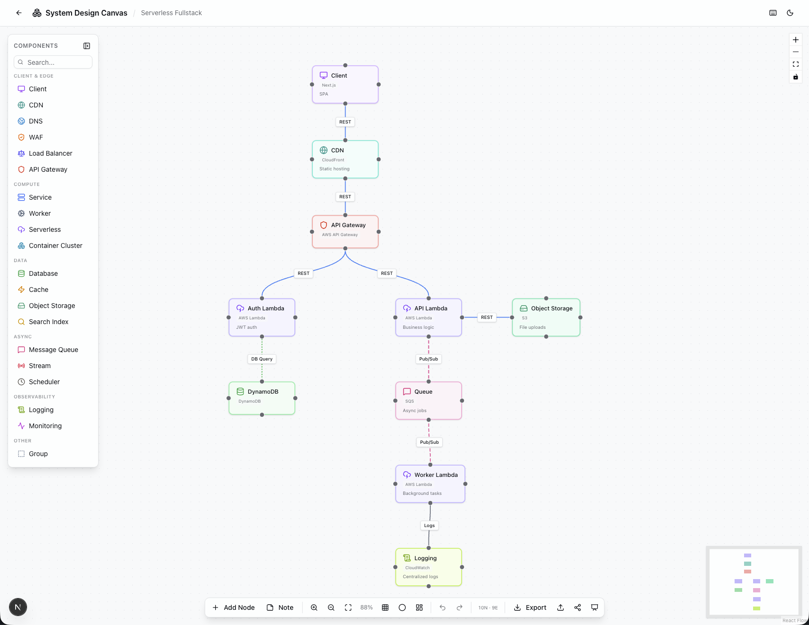
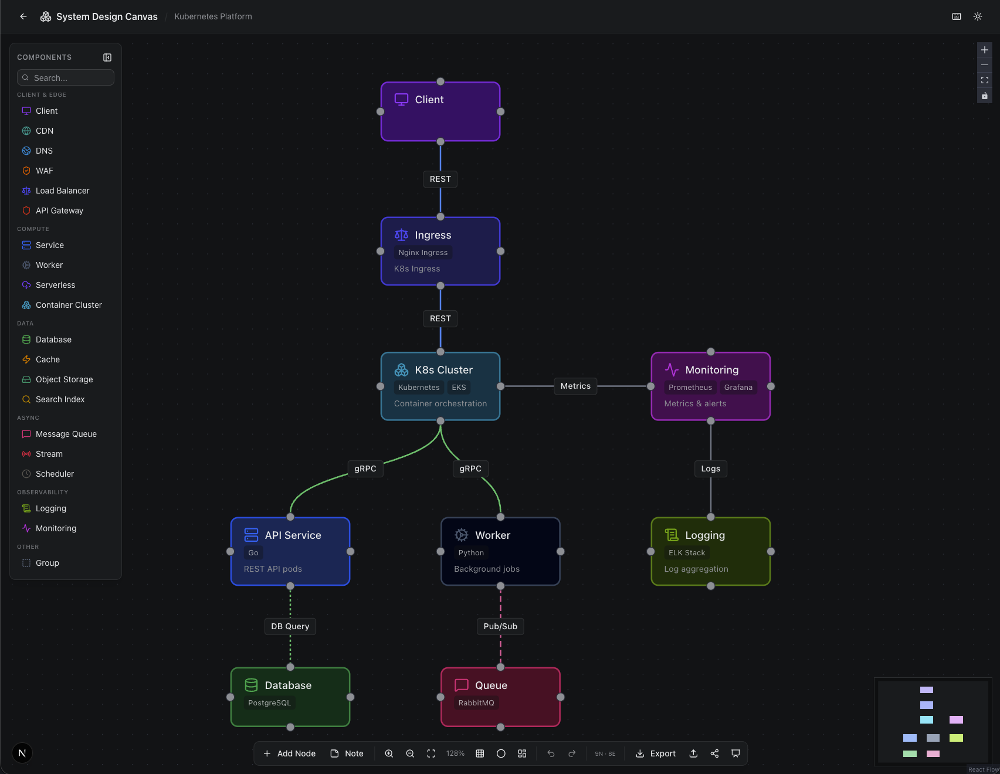
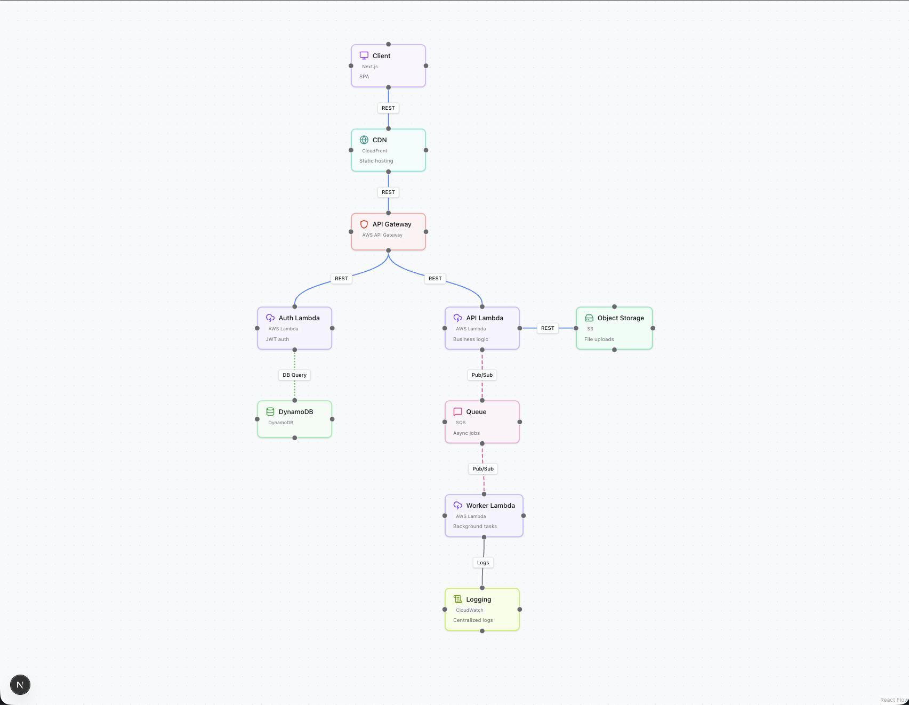

<div align="center">

# System Design Canvas

**Think through your system architecture before you build it.**

[](LICENSE)
[](https://nextjs.org)
[](https://reactflow.dev)
[](https://typescriptlang.org)

[**Live Demo**](https://system-design-canvas-one.vercel.app)

A free, open-source visual tool for sketching system architectures.
Drop components, wire them together, see your design take shape — all in the browser.

No sign-up. No servers. No data leaving your machine.



</div>

---

## Why?

Most system design happens on whiteboards that get erased, or in docs that nobody reads. System Design Canvas sits in between — a focused tool where you think visually about services, databases, queues, and how they connect, without the overhead of a full diagramming suite.

It's **opinionated by design**. Instead of a blank canvas with infinite shapes, you get the building blocks that actually matter: component types and connection types that map directly to real infrastructure patterns.

## Features

- **9 templates** — Microservices, Monolith, Event-Driven, Client-Server, Serverless, Data Pipeline, Real-time Analytics, Serverless Fullstack, Kubernetes Platform
- **19 component types** — Services, Databases, Caches, Queues, Load Balancers, CDNs, API Gateways, Serverless Functions, and more
- **9 connection types** — REST, gRPC, WebSocket, Pub/Sub, TCP, DB Query, GraphQL, MQTT, Event Stream
- **Context menu & multi-select** — Copy/paste, bulk delete, right-click actions
- **Presentation mode** — Clean fullscreen view for meetings and reviews
- **Export** — PNG, SVG, Mermaid diagram, JSON, shareable URL
- **Auto-layout** — One-click node arrangement with dagre
- **Dark mode** — Easy on the eyes, with soft background variants
- **Keyboard shortcuts** — Press `?` to see them all
- **100% client-side** — localStorage persistence, works offline

## Screenshots

<details>
<summary>Dashboard — project list & templates</summary>

| Light | Dark |
|-------|------|
|  |  |

</details>

<details>
<summary>Canvas — drag-and-drop architecture editor</summary>

| Light | Dark |
|-------|------|
|  |  |

</details>

<details>
<summary>Presentation mode</summary>



</details>

## Quick Start

```bash
git clone https://github.com/ozers/system-design-canvas.git
cd system-design-canvas
npm install
npm run dev
```

Open [http://localhost:3000](http://localhost:3000) and create your first project.

## Templates

| Template | Architecture |
|----------|-------------|
| Microservices | Client → LB → API Gateway → Services → DBs + Queue |
| Monolith | Client → LB → Monolith → DB + Cache |
| Event-Driven | Producers → Event Bus → Consumers → DBs |
| Client-Server | Client → CDN → API Server → DB + Cache |
| Serverless | Client → API Gateway → Lambda → DynamoDB + S3 |
| Data Pipeline | Sources → Kafka → Stream Processors → Warehouse |
| Real-time Analytics | LB → Ingest API → Kafka → Processing + Search |
| Serverless Fullstack | CDN → API Gateway → Lambda → DynamoDB + SQS |
| Kubernetes | Ingress → K8s Cluster → Services + Monitoring |

## Tech Stack

| Layer | Technology |
|-------|-----------|
| Framework | Next.js 15 (App Router, Turbopack) |
| Language | TypeScript |
| Canvas | React Flow v12 |
| State | Zustand |
| Styling | Tailwind CSS v4 + shadcn/ui |
| Layout | dagre |
| Export | html-to-image |
| Validation | Zod |

## Development

```bash
npm run dev      # Dev server with Turbopack
npm run build    # Production build
npm run lint     # ESLint
```

## License

[MIT](LICENSE)
