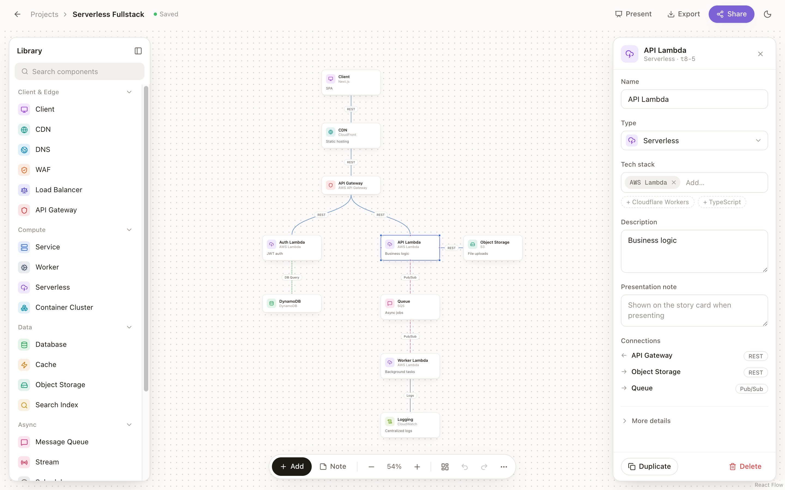
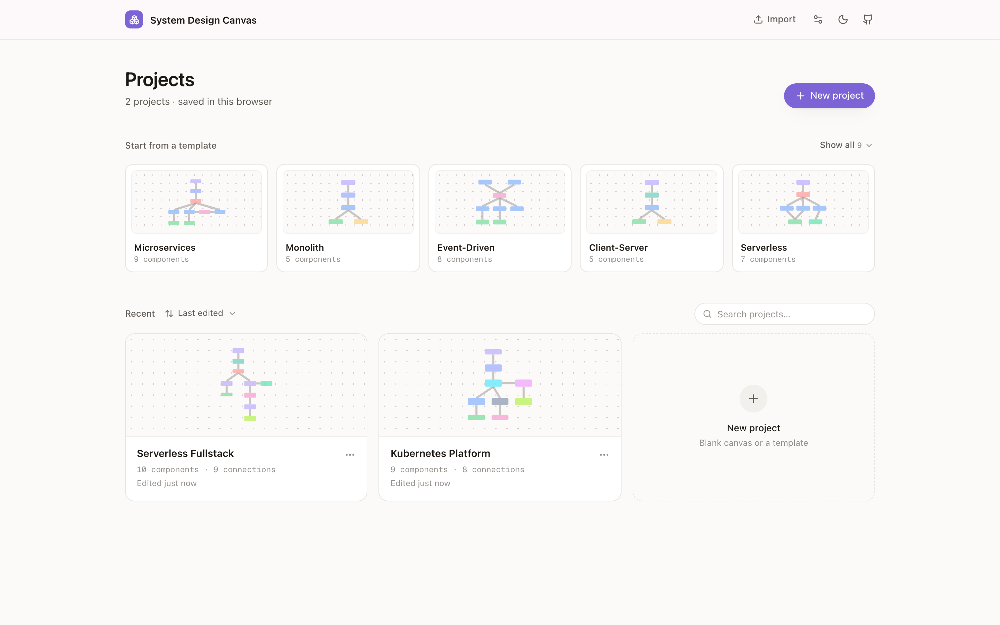
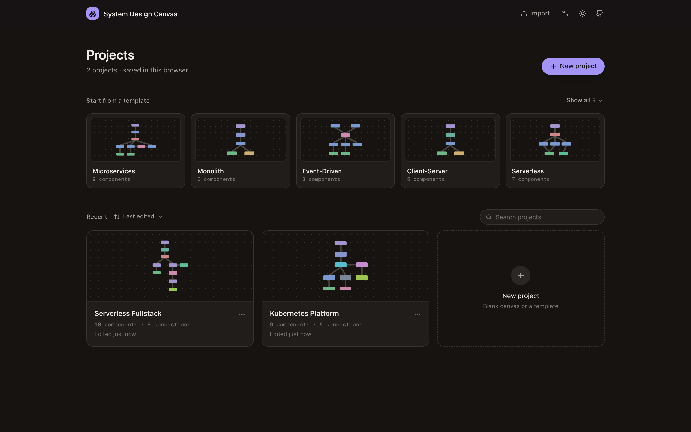
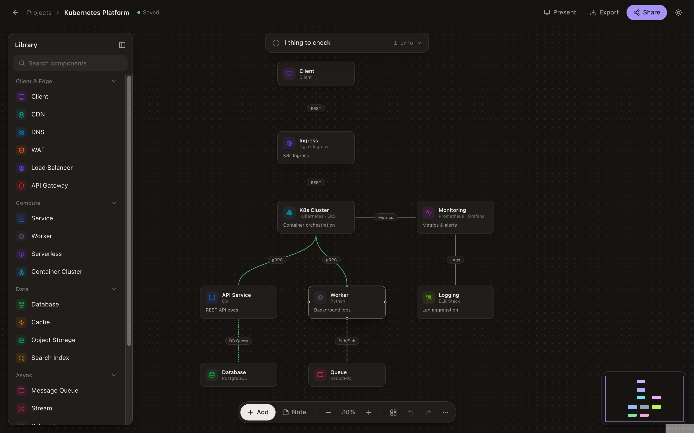
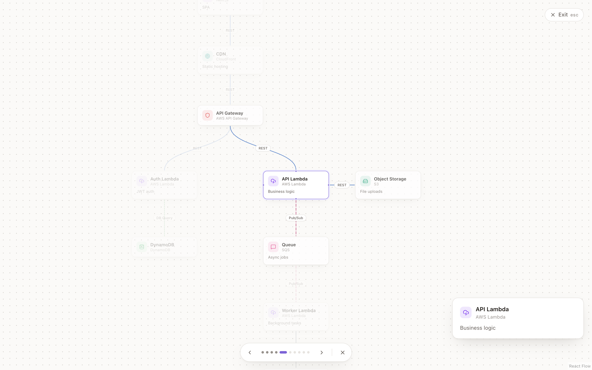

<div align="center">

# System Design Canvas

**Think through your system architecture before you build it.**

[](LICENSE)
[](https://nextjs.org)
[](https://reactflow.dev)
[](https://typescriptlang.org)

[**Live Demo**](https://system-design-canvas-one.vercel.app)

A free, open-source visual tool for sketching system architectures.
Drop components, wire them together, see your design take shape — all in the browser.

No sign-up. No servers. No data leaving your machine.



</div>

---

## Why?

Most system design happens on whiteboards that get erased, or in docs that nobody reads. System Design Canvas sits in between — a focused tool where you think visually about services, databases, queues, and how they connect, without the overhead of a full diagramming suite.

It's **opinionated by design**. Instead of a blank canvas with infinite shapes, you get the building blocks that actually matter: component types and connection types that map directly to real infrastructure patterns.

## Features

**Design**
- **9 templates** — Microservices, Monolith, Event-Driven, Client-Server, Serverless, Data Pipeline, Real-time Analytics, Serverless Fullstack, Kubernetes Platform
- **19 component types** — Services, Databases, Caches, Queues, Load Balancers, CDNs, API Gateways, Serverless Functions, and more — plus groups and sticky notes
- **9 connection types** — REST, gRPC, GraphQL, WebSocket, Pub/Sub, MQTT, SSE, TCP, DB Query
- **Component library** — Searchable, collapsible panel; drag onto the canvas or click to add
- **Node & connection editors** — Name, type, tech stack with suggestions, description, latency / format / throughput, reverse direction
- **Multi-select actions** — Group, align, duplicate, delete; right-click menus for everything
- **Design checks** — Flags disconnected components, likely bottlenecks and missing tech stacks as you work
- **Auto-layout** — One-click arrangement with dagre

**Share & present**
- **⌘K command menu** — Add components, run actions, jump to nodes or projects
- **Presentation mode** — Walks the diagram one component at a time, dims everything else and shows a story card per node
- **Export** — PNG (1×–3×, transparent background), SVG, JSON and Mermaid, with preview and copy to clipboard
- **Share links** — The whole design is compressed into the URL; recipients preview it and save their own copy
- **Import** — Project JSON (drag a file onto the dashboard) or a `docker-compose.yml`

**App**
- **Studio design system** — Warm neutral OKLCH tokens, light / dark / system theme
- **Settings** — Theme, snap to grid, minimap, design checks, animated edges, export / import / clear all data
- **Keyboard shortcuts** — Press `?` to see them all
- **Responsive** — Library becomes a bottom sheet and editors become drawers on narrow screens
- **100% client-side** — localStorage persistence, static export, deploys to any static host

## Screenshots

<details>
<summary>Dashboard — project list & templates</summary>

| Light | Dark |
|-------|------|
|  |  |

</details>

<details>
<summary>Canvas — drag-and-drop architecture editor</summary>

| Light | Dark |
|-------|------|
|  |  |

</details>

<details>
<summary>Presentation mode</summary>



</details>

## Quick Start

```bash
git clone https://github.com/ozers/system-design-canvas.git
cd system-design-canvas
npm install
npm run dev
```

Open [http://localhost:3000](http://localhost:3000) and create your first project.

## Keyboard Shortcuts

| Action | Keys |
|--------|------|
| Command menu | `⌘` `K` |
| Keyboard shortcuts | `?` |
| Toggle library | `/` |
| Fit view | `F` |
| Present | `P` |
| Duplicate | `⌘` `D` |
| Delete | `⌫` |
| Reverse connection | `⇧` `R` |
| Undo / Redo | `⌘` `Z` / `⇧` `⌘` `Z` |
| Copy / Paste | `⌘` `C` / `⌘` `V` |
| Select all | `⌘` `A` |
| Close panel | `Esc` |

On Windows and Linux use `Ctrl` instead of `⌘`.

## Templates

| Template | Architecture |
|----------|-------------|
| Microservices | Client → LB → API Gateway → Services → DBs + Queue |
| Monolith | Client → LB → Monolith → DB + Cache |
| Event-Driven | Producers → Event Bus → Consumers → DBs |
| Client-Server | Client → CDN → API Server → DB + Cache |
| Serverless | Client → API Gateway → Lambda → DynamoDB + S3 |
| Data Pipeline | Sources → Kafka → Stream Processors → Warehouse |
| Real-time Analytics | LB → Ingest API → Kafka → Processing + Search |
| Serverless Fullstack | CDN → API Gateway → Lambda → DynamoDB + SQS |
| Kubernetes | Ingress → K8s Cluster → Services + Monitoring |

## Tech Stack

| Layer | Technology |
|-------|-----------|
| Framework | Next.js 16 (App Router, Turbopack, static export) + React 19 |
| Language | TypeScript |
| Canvas | React Flow v12 |
| State | Zustand |
| Styling | Tailwind CSS v4 + shadcn/ui (Radix), OKLCH design tokens |
| Fonts & icons | Geist, Geist Mono, lucide-react |
| Layout | dagre |
| Export | html-to-image |
| Sharing | lz-string |
| Import | js-yaml (docker-compose) |
| Validation | Zod |
| Hosting | Vercel, Cloudflare Workers (static assets) |

## Development

```bash
npm run dev                 # Dev server with Turbopack
npm run build               # Static export to ./out
npm run lint                # ESLint
npm run deploy:cloudflare   # Build and deploy ./out to Cloudflare Workers
```

## Deployment

The app is fully client-side and builds to static files (`output: "export"` → `./out`), so any static host works.

| Host | How | Config |
|------|-----|--------|
| Vercel | Git integration — `main` deploys to production, PRs get previews | `vercel.json` (redirects old `/canvas/:id` links) |
| Cloudflare Workers | `npm run deploy:cloudflare` (requires `wrangler login`) | `wrangler.jsonc` (static assets, 404 page) |

### Moving users to a new address

Projects are stored in `localStorage`, which belongs to a single origin — a new domain starts empty. To move users gradually, set on the **old** deployment:

```bash
NEXT_PUBLIC_MIGRATE_TO=https://your-new-domain.example
```

The dashboard then shows a banner. *Move my projects* carries projects and settings to `<new domain>/import` inside the URL hash (never sent to a server), where they are previewed and merged. Unset the variable to turn the banner off; nothing is deleted either way.

## License

[MIT](LICENSE)
